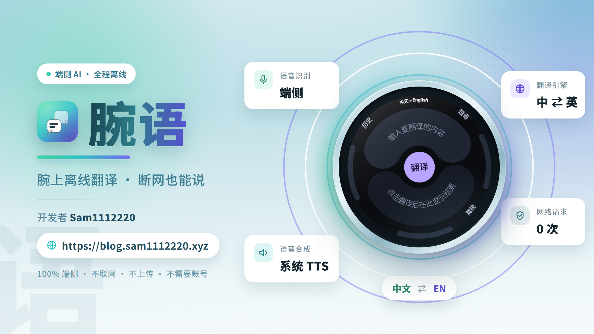
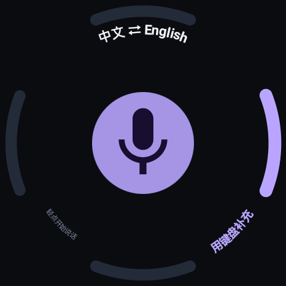
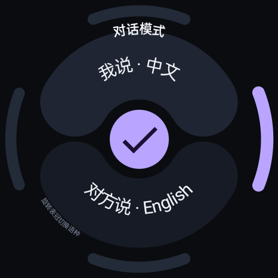
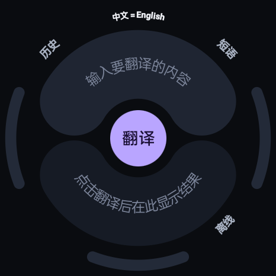
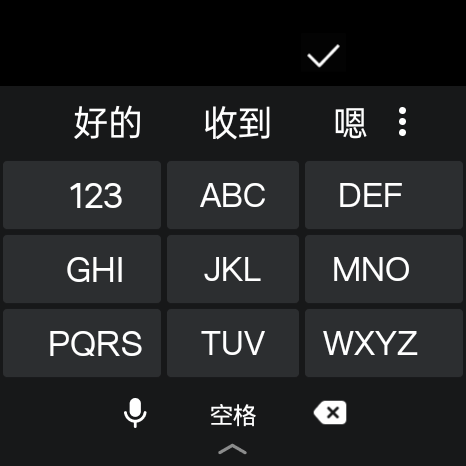
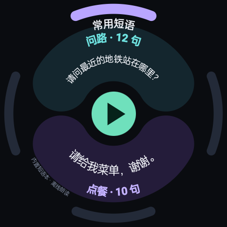
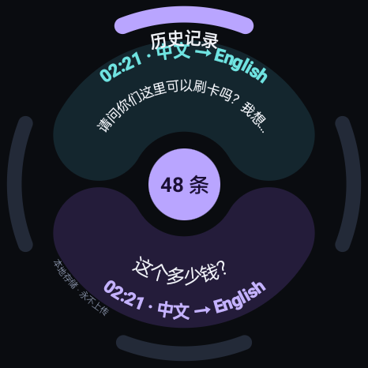

<div align="center">


# 腕语 TICTALK

**腕上离线翻译 · 断网也能说**

**完全离线的中英互译应用，为 Android 手表的小屏交互而设计**

语音识别 · 机器翻译 · 语音合成，三个环节全部在设备本地完成

不联网 · 不上传 · 不需要账号


</div>



---

## 概述

一款为手表而生的翻译工具。断网、飞行模式、拔掉 eSIM，它照样工作——因为**它从头到尾就没打算联网**。

手表上的翻译有个天然的尴尬：屏幕小、输入难、网络还未必有。这个项目把三件事都做到了端侧：

- 你说的每一句话，用**端侧语音识别**转成文字；
- 文字用**端侧机器翻译**换成另一种语言；
- 译文用**端侧语音合成**读出来，或者直接给对方看。

全程不产生任何网络请求，翻译内容不离开设备。

已在 **OPPO Watch X2**（型号 `OWW251`，Android 11，`armeabi-v7a`）实机开发与验证。

---

## 功能

### 语音翻译

点一下麦克风就能说话，**说完自动断句出结果**，不用去点那个很难点准的停止按钮。识别是流式的，边说边出字。

<table>
<tr>
<td align="center"><br><sub>聆听中</sub></td>
<td align="center"><br><sub>对话进行中</sub></td>
</tr>
</table>

### 对话模式

面对面对话的场景。双方语言可一键对调，说完一句自动进入下一句，来回切换不用回到上级菜单。

<table>
<tr>
<td align="center"><br><sub>选择语言</sub></td>
<td align="center"><br><sub>对话进行中</sub></td>
</tr>
</table>

### 文本翻译

嘈杂环境、或者想说点精确的表达时，直接用键盘输入。翻译结果可以朗读，也可以复制。

<table>
<tr>
<td align="center"><br><sub>翻译主页</sub></td>
<td align="center"><br><sub>键盘输入</sub></td>
</tr>
</table>

### 常用短语

内置分类短语本，用表冠切换分类，点一下朗读。出门在外最实用的其实是这一类——「洗手间在哪」「这个多少钱」，不用每次都现场说。

<table>
<tr>
<td align="center"><br><sub>短语本</sub></td>
<td align="center"><br><sub>历史记录</sub></td>
</tr>
</table>

---

## 交互设计

手表不是小号手机，很多理所当然的交互在这里会失效。项目针对手表做了这些取舍：

- **表冠优先** — 切换板块、切换短语分类、调音量都能用旋转表冠完成，不依赖精细触控；
- **弧形排布** — 圆形屏上正文沿弧带铺开，把弧面空间吃满，而不是硬套矩形布局；
- **自动断句** — 靠端点检测判断「说完了」，避开小按钮误触问题；
- **状态可感知** — 引擎状态会如实显示，不静默失败。比如本地语音包缺失时直接提示「请用键盘补充」，而不是点了没反应；
- **双形态自适应** — 圆形屏与方形屏各有一套布局，运行时按屏幕形状自动切换。

---

## 技术方案

| 环节 | 方案 | 说明 |
|:---|:---|:---|
| **语音识别** | sherpa-onnx + Zipformer 流式模型 | 中英双语，int8 量化，边说边出字 |
| **机器翻译** | ML Kit 端侧翻译（快速档）<br>OPUS-MT + ONNX Runtime（高精度档） | 双档可切换：快速档响应快，高精度档质量更好 |
| **语音合成** | 系统 TTS 引擎 | 复用设备已装离线语音包，语速音调可调 |
| **界面** | Jetpack Compose | 圆形 / 方形两套布局自适应 |

### 关于「离线」的边界

语音识别、翻译推理、语音合成本身**全部离线**。

唯一需要联网的是 ML Kit 语言包的**首次下载**（约 44MB，中英双向共用）。下载完成后即完全离线推理，翻译文本不会离开设备。如果你只使用「高精度档」，则连这一步都不需要。

---

## 代码结构

```
app/src/main/java/com/sam1112220/watchtranslate/
├── App.kt / AppVm.kt          应用入口与全局状态
├── MainActivity.kt
├── data/                      偏好设置、历史库（SQLite）、短语库
├── engine/
│   ├── SpeechIn.kt            语音识别：录音 + sherpa-onnx 流式解码
│   ├── SpeechOut.kt           语音合成
│   ├── MlKitEngine.kt         快速档翻译（ML Kit）
│   ├── LangDetect.kt          中英文判别
│   └── neural/                高精度档翻译
│       ├── NeuralMt.kt        ONNX 推理
│       ├── HfTokenizer.kt     分词器
│       └── ModelStore.kt      assets → 私有目录的模型解压
└── ui/
    ├── round/                 圆形屏布局与绘制原语
    ├── rect/                  方形屏布局
    ├── Common.kt              通用组件
    ├── Rotary.kt              表冠输入
    └── theme/
```

`app/src/main/jniLibs/` 下是预编译的 ONNX Runtime 与 sherpa-onnx 原生库，**无需安装 NDK** 即可构建。

---

## 关于平台

**这是一个标准 Android 应用，不依赖 Wear OS 专属能力。** 手表相关特性均以 `required="false"` 声明：

```xml
<uses-feature android:name="android.hardware.type.watch"  android:required="false" />
<uses-library  android:name="com.google.android.wearable" android:required="false" />
```

这意味着它可以装在 **Wear OS** 手表上，也可以装在 **OPPO Watch 等 Android 手表**上，甚至可以装在手机上运行调试。依赖里没有任何 `androidx.wear.*` 组件，构建产物不绑定特定厂商手表生态。

---

## 模型说明

模型文件**未包含在本仓库中**（合计约 408MB，其中语音识别 encoder 单个 173.5MB，超出代码托管平台的单文件限制）。

需要在 `app/src/main/assets/models/` 下按下述结构放置：

```
app/src/main/assets/models/
├── asr/
│   └── sherpa-onnx-streaming-zipformer-bilingual-zh-en-2023-02-20/
│       ├── encoder-epoch-99-avg-1.int8.onnx    (173.5 MB)
│       ├── decoder-epoch-99-avg-1.int8.onnx    ( 12.5 MB)
│       ├── joiner-epoch-99-avg-1.int8.onnx     (  3.1 MB)
│       └── tokens.txt
├── opus/
│   ├── zh-en/  {encoder,decoder}_model_quantized.onnx
│   │            + vocab.tsv, tokmeta.json, config.json
│   └── en-zh/  同上一套
└── nllb/
    ├── encoder_model_quantized.onnx
    ├── decoder_model_merged_quantized.onnx
    └── 分词器与配置
```

模型来源（均为公开模型）：

- **语音识别** — `sherpa-onnx-streaming-zipformer-bilingual-zh-en-2023-02-20`
  （HuggingFace `csukuangfj` 同名仓库，或 ModelScope 镜像 `pkufool` 同名仓库）
- **翻译** — `Xenova/opus-mt-zh-en`、`Xenova/opus-mt-en-zh`、`Xenova/nllb-200-distilled-600M`
  （取其中的 `onnx/*_quantized.onnx` 与分词器文件）

> 模型在 APK 内不做二次压缩（已配置 `noCompress`），首次启动时解压到应用私有目录，之后常驻复用。

---

## 一处值得记录的坑：原生库符号版本冲突

`app/src/main/jniLibs/` 下同时存在两份来源不同的库——ONNX Runtime（来自 `onnxruntime-android` AAR）与 sherpa-onnx 预编译包（自带一份 ORT）。两者的 `SONAME` **都叫 `libonnxruntime.so`**，而 APK 里只能留一份。

更麻烦的是，`libonnxruntime.so` 导出的入口 `OrtGetApiBase` 带**符号版本**，而 sherpa 与 ORT 的 Java 绑定是各自按编译时的版本号去查找它的。版本对不上，加载时直接报：

```
cannot locate symbol "OrtGetApiBase"
```

**解法**是统一版本，并改写另一方的版本需求。方向很关键——要改**符号耦合浅**的那一方：`libsherpa-onnx-jni.so` 只需要一个 `OrtGetApiBase`（稳定的 C API 入口），而 `libonnxruntime4j_jni.so` 需要三个 Ort 符号、深入 ORT 内部状态，**不能动它**。

改写时必须**同时改两处**，缺一不可：

1. `.dynstr` 段中的版本名字符串
2. `.gnu.version_r` 中该条目的 `vna_hash`（链接器先按 hash 定位版本节点）

`tools/` 下提供了两个脚本：

- `patch_symbol_version.py` — 改写某个 `.so` 的符号版本需求
- `elf_symbol_versions.py` — 查看某个 `.so` 的版本定义与需求

---

<div align="center">

## 许可

个人项目，供学习与交流使用

</div>
